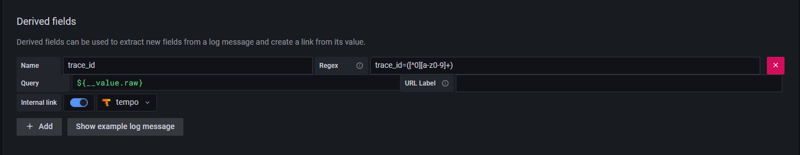
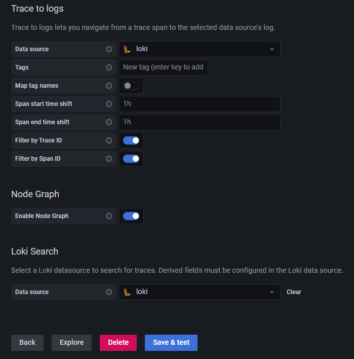

# PythonTracing

Flask Tracing stack, build-in `FlaskInstrumentor`, `LoggingInstrumentor`, `RequestsInstrumentor`. 
Helpful to build fast the flask app tracing. 
Adding tracing with OpnTelemetry and send/show traces in Grafana Tempo.

You can install the Loki Docker plugin using:

```shell
docker plugin install grafana/loki-docker-driver:latest --alias loki --grant-all-permissions
```

## Requirements
- docker
- docker-compose
- loki docker plugin

## Packages required:

- flask==2.2.2
- opentelemetry-exporter-otlp==1.12.0
- opentelemetry-instrumentation-logging
- opentelemetry-instrumentation==0.30b1
- opentelemetry-distro==0.33b0
- opentelemetry-instrumentation-flask==0.30b1
- opentelemetry-instrumentation-requests==0.30b1


## Grafana Loki & Tempo configuration

__Loki datasource__



__Tempo datasource__

 